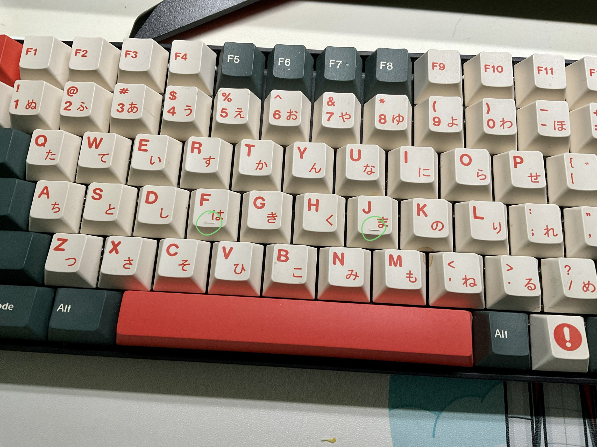

## What is touch typing?

[Touch typing](https://en.wikipedia.org/wiki/Touch_typing?oldformat=true) is a typing technique that let you make use of all you fingers, according to many practitioners' result, after a month of systematic taining (about 30 minutes a day), their typing speed doubled (30-40 wpm to over 80 wpm). Nowadays, most of the work can be done in front of the computer with the keyboard, therefore, I think it is really important to improve the productivity form this perspective. This doesn't require much other requirement, but only your effort and a comfortabble keyboard.

Have you ever wondered the little bar on the **`f`** and **`j`** in your keyboard?

This little bar is used for correctly positioning your fingers into the right place.

You are supposed to put your fingers as following:

This row is called **home row**, which is the center of your keyboard. When you put your fingers in this position, the total distance for moving fingers when typing is the least, means your fingers can move faster when you are familiar with this typing style. Each finger only be responsible for a certain area of keyboards as the illustration below (thumbs are responsible only for the blank space).

## Pros & Cons

### Pros

The pros of touch typing is quiet obvious. Make use of every finger (rather than only use index and middle finger as I used to) to double the productivity.

Ideally, when your prductivity doubled, you can finish your tasks faster and have much more time to do something else, this is the only reason I want to learn this technique. For most of the time, my hands can't typing as fast as my brain, which made me very annoying, I believe after learning touch typing for a while, I can solve this problem.

Let's do a kindergarden mathematics. Suppose your typing speed is average (40 words per minutes or **wpm**), each day you spend 4 hours typing, which means you can type around 
$$
40\times60\times 4 = 9600 \text{ words}
$$
(of course this calculation ignores the thinking time), if your speed doubled, you can save half of typing time a day, that's sounds really attracting.

### Cons 

However, as many other techniques which can improve your productivity as well, touch typing has a extreme steep learning curve. All of us knows how to typing, but when you want to learn touch typing, you must leave your comportable zone (the typing style you are familar with), and relearn it from zero. The most difficult part is to forget all your prior muscle memory.

I have tried touch typing for a while (about 4~5 hours), and the most difficult part until now is I can't use my last two fingers (pinky and ring finger) as swift as possible.

## Resoruces

Following is useful websites help me a lot while learning touch typing:

- [monkeytype](https://monkeytype.com/): A website for every day speed testing and practice, it has a detailed statistics system which can record all your practice records and a fully customizable training system, you can choose what kind of text you ewant to practice. Most importantly, it is totally **free**!
- [TypingClub](https://www.typingclub.com/): Learn the basic of touch typing with games. You can use this website to get to know the detail of touch typing by well designed games in your browser.

## Daily Progress

> I will practice touch typing every day and record my progress here.

- 2022-11-23:	29wpm / 94%acc, little finger is so hard to use😵‍💫.
